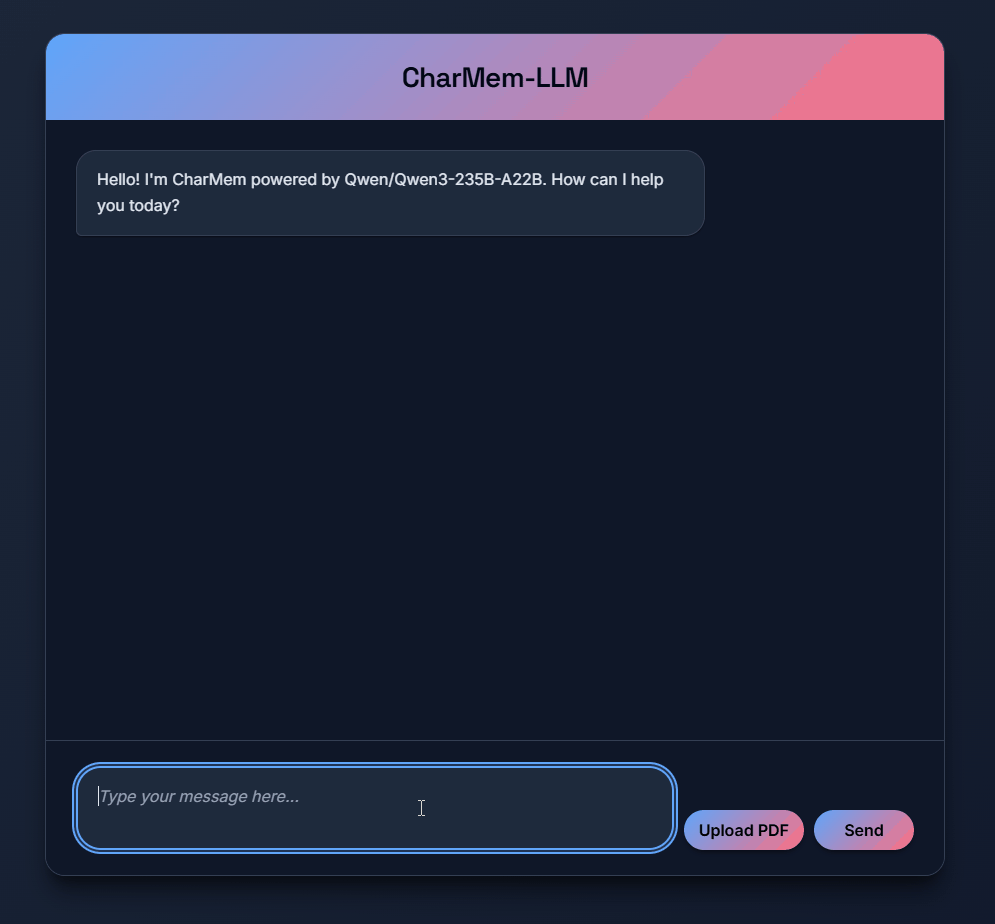
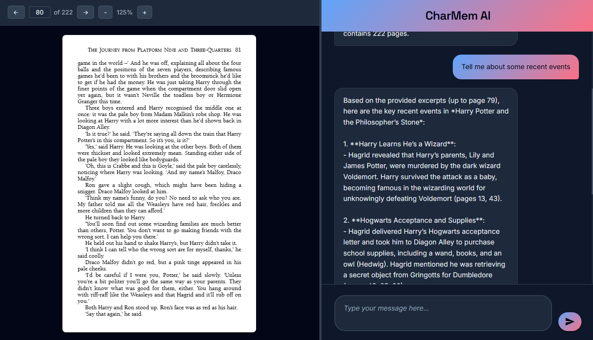
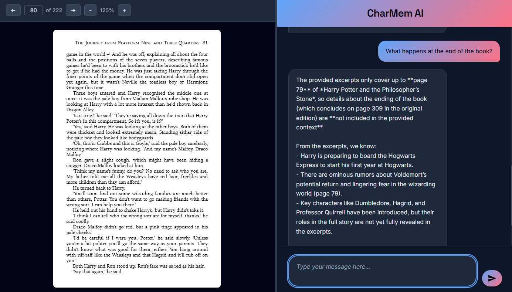

# CharMem: AI-Powered Character Memory Assistant

> Lost the plot? Use CharMem!

CharMem is an intelligent chat application that helps readers keep track of characters in books and novels. Using retrieval augmented generation (RAG) with anti-spoiler technology, it provides instant character summaries, first meeting details, and recent events with precise page references - all while ensuring you never see information from pages you haven't read yet.

## 🌟 Key Features

-   **📄 PDF Upload & Processing**: Upload any PDF book for instant character analysis
-   **🔍 Anti-spoiler Conversations**: Ask about plot points, characters or summaries - without spoilers!
-   **🤖 AI-Powered Responses**: Powered by Qwen-235B model via Hugging Face Inference API
-   **💬 Real-time Chat Interface**: WebSocket-based chat with typing indicators
-   **📍 Page References**: Get exact page numbers for character introductions and events
-   **🎨 Modern UI**: Responsive dark-themed interface with smooth animations

## 🎬 Demo

<!--  -->

<!-- _See CharMem in action: Upload a PDF, ask about characters, and get instant insights with page references!_ -->


_CharMem answers questions about book based on where you're up to in the book - including the page numbers for reference!_


_CharMem will never reveal spoilers that you haven't read yet!_

## 🚀 Quick Start

### Prerequisites

-   Python 3.11 or 3.12
-   Hugging Face API token

### Installation

#### Option 1: Using UV (Recommended)

1. **Install UV ([see instructions](https://docs.astral.sh/uv/getting-started/installation/))**

2. **Clone and setup**

    ```bash
    git clone https://github.com/edwarddavis1/CharMem-LLM.git
    cd CharMem
    uv sync
    ```

3. **Run the application**
    ```bash
    uv run run.py
    ```

#### Option 2: Using Standard Python/Pip

1. **Clone the repository**

    ```bash
    git clone https://github.com/edwarddavis1/CharMem-LLM.git
    cd CharMem
    ```

2. **Create virtual environment**

    ```bash
    python -m venv .venv

    # On Windows
    .venv\Scripts\activate

    # On macOS/Linux
    source .venv/bin/activate
    ```

3. **Install dependencies**

    ```bash
    pip install .
    ```

4. **Run the application**
    ```bash
    python run.py
    ```

#### Final Steps (Both Options)

1. **Generate a Hugging Face API token**

    - Go to [Hugging Face](https://huggingface.co/docs/hub/en/security-tokens) and create a user access token.
    - Copy the token for use in the next step.

2. **Set up environment variables**
   Create a `.env` file in the root directory:

    ```bash
    HUGGINGFACE_API_TOKEN=your_huggingface_api_token_here
    ```

3. **Open your browser**
   Navigate to `http://localhost:8000`

## 🔧 Minimal Code Example

Here's how to use CharMem programmatically:

```python
from backend.RAG import EmbeddedPDF
from langchain.document_loaders import PyPDFLoader

# Load your PDF
loader = PyPDFLoader("path/to/your/book.pdf")
pages = loader.load()

# Create embedder and process PDF
pdf_embedder = EmbeddedPDF()
pdf_embedder.embed_pdf(pages)

# Query character information
response = pdf_embedder.generate_character_analysis("Character Name")
print(response)
```

## 🛠️ Technology Stack

-   **Backend**: FastAPI with WebSocket support
-   **AI/ML**: Hugging Face Inference API, LangChain, ChromaDB
-   **Frontend**: Vanilla JavaScript with modern CSS
-   **Vector Embeddings**: sentence-transformers/all-MiniLM-L6-v2
-   **Language Model**: Qwen-235B-A22B

## 🏗️ Project Structure

```
CharMem/
├── app/
│   ├── static/
│   │   ├── css/
│   │   │   └── styles.css         # Main stylesheet with dark theme
│   │   └── js/
│   │       └── chat.js            # WebSocket chat and PDF viewer logic
│   └── templates/
│       └── index.html             # Main HTML template
├── backend/
│   ├── RAG.py                     # RAG implementation and PDF processing
│   └── config.py                  # Model configuration
├── experiments/
│   └── minimal_example.py         # Development and testing scripts
├── personal_log/
│   ├── log.md                     # Development log and progress notes
├── demo/                          # Demo images and assets
├── main.py                        # FastAPI application
├── run.py                         # Application runner
├── pyproject.toml                 # Dependencies and project config
└── README.md                      # Project documentation
```

## 🔮 Features Coming Soon...

-   **In-Character Responses**: Chat with characters as if they were real
-   **Advanced Character Profiles**: Detailed character cards with relationships, motivations, and development arcs
-   **Multi-Book Library**: Manage multiple books with cross-references and series continuity
-   **Character Relationship Maps**: Visual network graphs showing character connections and locations
-   **Character Avatars**: AI-generated character portraits based on descriptions
-   **Audio Book Integration**: Sync with audiobook progress and timestamps
